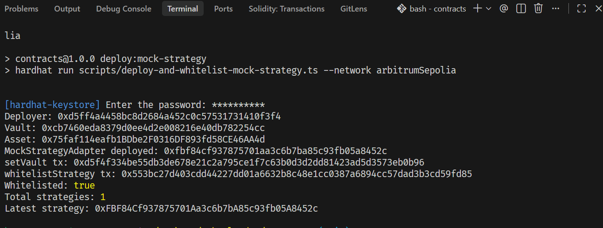

# Kabon

Kabon is a policy-driven DeFi treasury copilot for Arbitrum. Users deposit a supported asset into a vault, receive ERC-4626 vault shares as their receipt, and use a guided product flow to evaluate allocation opportunities, review recommendation logic, and withdraw with clearer unwind expectations.

The product is Arbitrum-first today, with wallet support expanded to include Robinhood Chain testnet so the app can speak credibly to tokenized asset and RWA workflows as that ecosystem opens up.

This repository contains three workspaces:

- [contracts](C:\Users\hp\Desktop\arbs-london\contracts): Hardhat 3 smart contracts, proxy deployment modules, and tests
- [web](C:\Users\hp\Desktop\arbs-london\web): Next.js frontend, wallet integration, and app-facing API routes
- [indexers](C:\Users\hp\Desktop\arbs-london\indexers): The Graph subgraph for real-time vault event indexing

## Product Model

Kabon is built around one vault per supported asset.

At a high level:

1. a user deposits an asset into the vault
2. the vault mints ERC-4626 shares to the user
3. the vault operator can deploy idle liquidity into approved strategy adapters
4. users withdraw by redeeming shares for underlying assets
5. if idle liquidity is insufficient, the vault recalls liquidity from strategies using a configured withdrawal queue

The user does not have to exit protocols one by one. Their position is represented by vault shares, while the vault manages the underlying routing.

Execution is therefore vault-mediated rather than protocol-by-protocol from the user wallet. Kabon recommends and frames compliant routes, while approved operator flows and whitelisted adapters perform the underlying allocation on behalf of vault participants.

## Repository Layout

```text
arbs-london/
  contracts/   Vault contracts, mocks, Ignition modules, tests
  web/         Next.js app, UI components, API routes, wallet setup
```

## Contracts Summary

The contracts workspace currently includes:

- an upgradeable ERC-4626 vault
- owner-managed strategy whitelisting and controls with permissionless route execution on approved adapters (hackathon mode)
- explicit withdrawal queue management for unwind order
- proxy deployment through Hardhat Ignition and OpenZeppelin transparent proxies
- reentrancy protections on vault entrypoints and strategy callbacks
- hardening against fee-on-transfer assets and adapter misreporting on deploy/recall flows
- tests covering deposits, withdrawals, upgrades, strategy accounting, and admin controls

See [contracts/README.md](C:\Users\hp\Desktop\arbs-london\contracts\README.md) for contract architecture and deployment details.

## Web Summary

The frontend workspace currently includes:

- a primary home/dashboard experience that combines wallet balances, deposit actions, and copilot recommendations
- wallet connection through Reown AppKit
- live Arbitrum market, protocol, and opportunity data
- a live recommendation engine exposed through app API routes
- Arbitrum-focused market data plus Robinhood Chain testnet wallet support
- Polygon / Massive-backed stock pricing and chart history for supported Robinhood RWA symbols
- protocol explorer and opportunity detail pages
- dedicated activity and withdrawal surfaces for event history and exit visibility

See [web/README.md](C:\Users\hp\Desktop\arbs-london\web\README.md) for frontend setup details.

## Indexers Summary

The indexers workspace contains a The Graph subgraph for real-time vault event indexing:

- tracks vault events: Deposit, Withdraw, StrategyAllocated, StrategyRecalled, StrategyWhitelisted, WithdrawalQueueUpdated
- deployed on Graph Studio for live querying
- provides GraphQL API for historical and real-time vault activity data
- supports activity history and analytics for the frontend

### Live Subgraph Endpoint

**Query URL:** https://api.studio.thegraph.com/query/1749198/kabon-vault/v0.0.1

**Studio URL:** https://thegraph.com/studio/subgraph/kabon-vault

### Local Development

```bash
cd indexers/kabon-vault
bun install
graph codegen
graph build
graph deploy kabon-vault
```

## Current Demo Status

Status checked on April 29, 2026:

- wallet connect is implemented
- vault deposit flow is implemented in the homepage flow when supported env vars and vault addresses are configured
- live protocol and opportunity browsing is implemented for Arbitrum
- recommendation generation is implemented over live market data with structured allocation reasoning
- Robinhood Chain wallet balances and stock-token assets now render with chain-aware branding in the dashboard
- tokenized-equity pricing and chart history now prefer Polygon / Massive market data when configured
- copilot UI is implemented with recommendation, rationale, and allocation framing in the product flow
- withdraw and activity experiences are present in the application and positioned for deeper live integration
- Arbitrum Sepolia vault deployment, strategy whitelisting, and protocol route wiring are now live for hackathon demo flows

## Local Development

### Contracts

```bash
cd contracts
yarn install
npx hardhat compile
npx hardhat test
```

### Web

```bash
cd web
bun install
bun run dev
```

## Current Security Posture

The vault layer has explicit protections for several common failure modes:

- implementation initializer locking for the upgradeable contract
- non-reentrant deposit, mint, withdraw, redeem, deploy, recall, and sync flows
- rejection of short-receipt asset transfers during deposits and strategy deployment
- rejection of adapters that misreport recalled or deployed asset amounts
- two-step ownership transfers
- disabled ownership renounce to avoid orphaning vault controls
- pause required before syncing a realized strategy loss into vault accounting

This does not remove the need to review every production strategy adapter independently. Adapter code remains part of the trust boundary.

## What This Repo Is Good For

This repository is a strong base for:

- demonstrating the Kabon product model
- iterating on ERC-4626 vault behavior
- building operator workflows around strategy deployment and unwind management
- connecting a frontend to a vault-driven yield product
- positioning the product around both DeFi treasury management and emerging tokenized-asset / RWA rails

It should still be treated as a project under active development rather than a finished production deployment package.

## Hackathon Submission Snapshot

### One-line Pitch

Kabon is a policy-driven vault copilot that helps users and DAOs deposit once, evaluate vetted yield routes, and withdraw with transparent unwind logic on Arbitrum, with Robinhood Chain support as an RWA expansion path.

### Problem

- yield routing is fragmented and manual
- users and operators must track APY/liquidity across many protocols
- withdrawals are operationally hard when liquidity is not immediately idle

### Solution

- single vault deposit flow with ERC-4626 shares as the user receipt
- strategy deployment and unwind queue handled at vault/operator layer
- recommendation and policy-driven execution framing in the app UX
- clearer withdrawal expectations when recalls are needed

### Requirement Fit Snapshot

- `Landing / product overview`: mostly covered in the homepage flow
- `Create policy`: covered through the copilot setup and vault guidance flow today
- `Vault dashboard`: covered in the homepage/dashboard experience
- `Recommendation details`: covered inline through copilot signals and recommendation detail UI
- `Withdraw flow`: supported by the vault model and surfaced through the product UX
- `Activity history`: supported in the app structure and ready for deeper indexing integration
- `AI layer`: recommendation logic, rationale, and policy-aware guidance are implemented in the copilot experience, with execution framed around whitelisted vault allocation flows
- `Deployment`: live on Arbitrum Sepolia with whitelisted route execution

### Judging Criteria Mapping

- **Smart contract quality**: upgradeable vault architecture, non-reentrant entrypoints, strategy accounting checks, and test coverage for deploy/withdraw/unwind/upgrade flows
- **Product-market fit**: targeted at users and treasuries that want simplified yield operations

Current execution milestone:

1. the user deposits into a Kabon vault
2. Kabon ranks and explains approved opportunities
3. the user executes route deployment through whitelisted adapters from the protocol opportunity flow
4. the vault continues to represent the user position through ERC-4626 shares

Kabon approaches “stake on behalf of the user” through vault-level allocation and share-based accounting, while approved adapters handle protocol-specific interactions.

### Submission Checklist

- deployed on an eligible Arbitrum ecosystem chain
- at least one Robinhood Chain-facing path included in the user flow
- test commands and expected outputs documented for reviewers

Current note on May 1, 2026: Arbitrum Sepolia live deployment and route wiring are complete for demo submission. Remaining work is production-grade hardening and broader protocol coverage.

## Deployment + Address Wiring

There is now a supported deploy script in the contracts workspace:

```bash
cd contracts
DEPLOY_ASSET=USDC npx hardhat run scripts/deploy-supported-vault.ts --network arbitrumSepolia
```

That script writes frontend-readable vault addresses into:

- [web/lib/generated/vault-addresses.json](C:\Users\hp\Desktop\arbs-london\web\lib\generated\vault-addresses.json)

Official Robinhood Chain testnet stock-token addresses and official Circle USDC addresses are tracked in:

- [contracts/config/supported-assets.ts](C:\Users\hp\Desktop\arbs-london\contracts\config\supported-assets.ts)

## Hackathon Live Deployment Proof

### Live contracts (Arbitrum Sepolia)

- Vault proxy: `0x23d80c8c231d7bf671ac54cd5854728535063254`
- Vault implementation: `0x219ccc99ab55c001f9c48cec3740d6a64518bd72`
- Aave V3 strategy adapter (USDC): `0xC9d2E20859020375c8C7517464A2Ee890Ff0864F`
- Aave V3 Pool: `0xBfC91D59fdAA134A4ED45f7B584cAf96D7792Eff`
- Aave V3 USDC aToken: `0x460b97BD498E1157530AEb3086301d5225b91216`

### Explorer links

- Vault proxy: https://sepolia.arbiscan.io/address/0x23d80c8c231d7bf671ac54cd5854728535063254
- Vault implementation: https://sepolia.arbiscan.io/address/0x219ccc99ab55c001f9c48cec3740d6a64518bd72
- Aave strategy adapter: https://sepolia.arbiscan.io/address/0xC9d2E20859020375c8C7517464A2Ee890Ff0864F
- Whitelist tx: https://sepolia.arbiscan.io/tx/0xbdb850cd11f45772e672f410862b444631f5e787d8e750220eaa776d9f92f2ba

### Frontend env wiring

```bash
NEXT_PUBLIC_AAVE_USDC_SEPOLIA_STRATEGY_ADDRESS=0xC9d2E20859020375c8C7517464A2Ee890Ff0864F
```

## Known Limitations / Next Steps

- Route registry is currently env-and-mapping based for hackathon speed; move to onchain/DB-backed registry for production.
- Strategy adapter set is currently minimal (Aave USDC path); expand adapter coverage and add robust route selection.
- Add additional production hardening (governance/multisig controls, audits, monitoring, alerting).

## Hackathon Route Setup + Proof

### 1) Deploy and whitelist a mock route (fast smoke test)

```bash
cd contracts
VAULT_ADDRESS=0x23d80c8c231d7bf671ac54cd5854728535063254 npm run deploy:mock-strategy -- --network arbitrumSepolia
```

### 2) Deploy and whitelist the real Aave USDC adapter

```bash
cd contracts
VAULT_ADDRESS=0x23d80c8c231d7bf671ac54cd5854728535063254 \
AAVE_POOL_ADDRESS=0xBfC91D59fdAA134A4ED45f7B584cAf96D7792Eff \
AAVE_ATOKEN_ADDRESS=0x460b97BD498E1157530AEb3086301d5225b91216 \
ASSET_ADDRESS=0x75faf114eafb1BDbe2F0316DF893fd58CE46AA4d \
npm run deploy:aave-strategy -- --network arbitrumSepolia
```

### 3) Wire frontend route mapping to deployed strategy

Set this in `web/.env.local` and restart the web app:

```bash
NEXT_PUBLIC_AAVE_USDC_SEPOLIA_STRATEGY_ADDRESS=0xC9d2E20859020375c8C7517464A2Ee890Ff0864F
```

### Whitelisted route proof

`hardhat run scripts/deploy-and-whitelist-mock-strategy.ts --network arbitrumSepolia`


